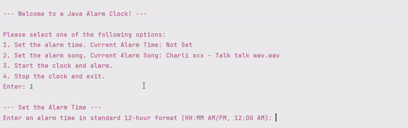

# Java Alarm Clock

This is a simple Java alarm clock application which I created while learning Java programming. This project helped me practice working with files, time management ('LocalTime'), multithreading, user interaction (console-based I/O), and audio playback. 

## Table of Contents

- [Overview](#overview)
- [Video Demo](#video-demo)
- [Features](#features)
- [File Structure](#file-structure)
- [Requirements](#requirements)
- [How To Use](#how-to-use)

## Overview

The application allows the user to set an alarm time, choose a custom alarm song, display a live clock until the alarm is triggered, and play the select audio file once the alarm time is reached. 

## Video Demo

>_To see the demo with sound, check out [Demo Videos](./demo)_

## Features

- ✅ Set an alarm time in standard 12-hour format (HH:mm AM/PM)
- ✅ Choose a custom alarm song (`.wav` files only)
- ✅ Display a live clock updating every second
- ✅ Plays the audio file when the alarm is triggered
- ✅ Allow the user to stop the alarm with input
- ✅ User-friendly console-based interface

## File Structure:
- **Main.java**: Entry point of the program. Manages the flow of the program and user interaction.
- **AlarmClock.java**: Contains the logic for the alarm clock (alarm time, audio playback, alarm triggering, and clock state).
- **UserInterface.java**: Defines the methods for interacting with the user (displaying messages and getting input).
- **ConsoleUserInterface.java**: Console-based implementation of the `UserInterface`, for input/output.

## Requirements
- Java 23 or higher
- A `.wav` file for a custom alarm sound

> _Note: This project was developed using IntelliJ IDEA and Java 23. Additional configuration may be required for other IDEs/editors._

## How to Use:

1. **Run the application:**
- Compile and run `Main.java` to start the alarm clock application.
  
2. **Set the Alarm Time:**
- Select option 1 to set the alarm time.
- Enter the time in 12-hour format (HH:mm AM/PM).
  
3. **Set the Alarm Sound (Optional):**
- Select option 2 to set the alarm sound.
- Provide the file path to a `.wav` file, or type "no" to keep the current/default sound.
  
4. **Start the Clock and Alarm**
- Select option 3 to start the clock.
- The live clock will display until the alarm time matches the current time.

5. **Stop the Alarm and Exit:**
- When the alarm triggers, enter any key to stop the alarm.
- If you're finished with the application, select option 4 to exit the program.
